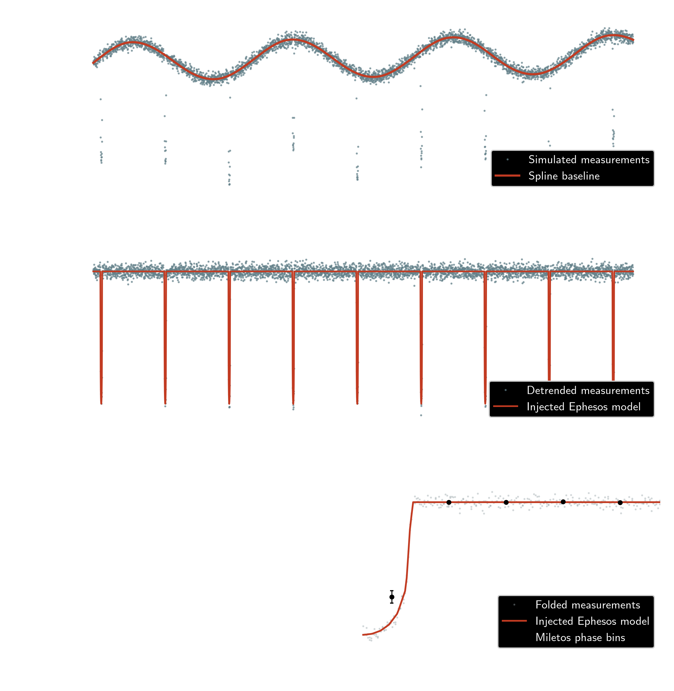

# Miletos

## Purpose
Miletos is a time-series analysis and forward-modeling pipeline for astrophysical systems. It is designed to interpret time-domain photometry and related observations by combining detrending, period searches, diagnostics, and Bayesian forward modeling.

## Scope
Miletos detrends observational time series, searches for periodic signals, phase-folds and bins measurements with uncertainty propagation, fits forward models, and generates diagnostic plots and summary products.

## Installation

```bash
cd /path/to/miletos
python -m pip install -e .
export MILETOS_PATH=/path/to/miletos
```

`MILETOS_PATH` identifies the repository root. Runtime inputs belong under `$MILETOS_PATH/data/` and generated pipeline outputs belong under `$MILETOS_PATH/visuals/`. Both directories are ignored by Git. Miletos does not use a separate data-path environment variable.

## Minimal usage
Set `MILETOS_PATH` to the repository root and run the deterministic diagnostic:

```bash
python examples/simulated_transit/run.py --typefileplot png
```

The example injects an Ephesos transit into a deterministic simulated light curve, then uses Miletos to mask the transits during spline detrending, phase-fold the result, and calculate uncertainty-aware phase bins. It writes `examples/simulated_transit/visuals/simulated_transit_diagnostic.png`; use `--typefileplot pdf` for a vector figure.



The figure is generated from an explicitly simulated benchmark, not observational data. The reusable API is also available directly:

```python
from pathlib import Path

from miletos.diagnostics import run_simulated_transit_diagnostic

result = run_simulated_transit_diagnostic(Path("visuals/transit_diagnostic.png"))
```

## Examples

Run the complete example set:

```bash
python examples/run_all.py
```

Use `--typefileplot pdf` to generate vector figures.

Each script can also be run separately:

```bash
python examples/simulated_transit/run.py
python examples/target_visibility/run.py
python examples/TOI-1233/run.py
python examples/WASP-39b/run.py
python examples/catalog/run.py
```

The equivalent Jupyter notebooks provide interactive access to every maintained
example workflow:

- [Simulated transit](examples/simulated_transit/SimulatedTransit.ipynb)
- [Target visibility](examples/target_visibility/TargetVisibility.ipynb)
- [Joint TESS and PFS analysis of TOI-1233](examples/TOI-1233/JointPhotometryRadialVelocity.ipynb)
- [Daylan et al. (2021) analysis of TOI-1233](examples/TOI-1233/Daylan2021.ipynb)
- [JWST ERS analysis of WASP-39b](examples/WASP-39b/WASP39ERS.ipynb)
- [Miletos configuration catalog](examples/catalog/ConfigurationCatalog.ipynb)

Each notebook delegates data access, analysis, and plotting to a reusable Miletos
entry point. The notebooks configure workflows, report returned quantities, and
display Miletos-generated figures without duplicating pipeline calculations.

The simulated transit and target-visibility calculations are deterministic and run without network access. The WASP-39b analysis downloads the public Alderson et al. (2023) NIRSpec G395H products from Zenodo and visualizes the published light-curve reduction sequence. The six figures show detector-level white-light curves, measured detector motion, raw spectroscopic flux with its systematics model, corrected flux with its transit model and residuals, all 349 corrected wavelength channels, residual and photon-noise precision, and the final 344-bin weighted transmission spectrum with its best-fit ATMO model. Data are cached under `$MILETOS_PATH/data/WASP-39/ERS_G395H_Alderson2023/`, while figures are written under `examples/WASP-39b/visuals/`. The source dataset is DOI 10.5281/zenodo.7185300 and the associated Nature article is DOI 10.1038/s41586-022-05591-3.

Run the joint Transiting Exoplanet Survey Satellite (TESS) and Planet Finder Spectrograph (PFS) analysis of TOI-1233 with:

```bash
python examples/TOI-1233/run.py
```

The default run writes the transit-timing-variation figures to `examples/TOI-1233/PlanetarySystemWithTTVs/visuals/`. Run `python examples/TOI-1233/run.py --model PlanetarySystem` to produce the standard planetary-system alternative. Observational inputs remain under `$MILETOS_PATH/data/TOI-1233/`.

The notebook `examples/TOI-1233/Daylan2021.ipynb` reproduces the four-planet photometric analysis reported by Daylan et al. (2021), AJ 161, 85 (DOI `10.3847/1538-3881/abd73e`). It configures the publication-era Sectors 10 and 11 and the published four-planet priors, then delegates data discovery, retrieval, quality masking, normalization, Gaussian-process detrending, transit fitting, plotting, and machine-readable output to the Miletos pipeline. The notebook contains no manual observational data wrangling.


## Input Data
The input time-series data can include photometry, spectroscopy, radial velocity, or astrometry. Examples are time-series data from the Transiting Exoplanet Survey Satellite (TESS) and JWST, Legacy Survey for Space and Time (LSST), radial velocity surveys such as HARPS, PFS, and NEID.


## Data gathering
Given a target, Miletos searches for time-series data using MAST (e.g., TESS, Kepler, HST, and JWST).


## Analyses
Miletos performs preliminary analyses such as detrending, phase-folding, producing Lomb-Scargle periodograms (via Astropy), and performing Box Least Squares (BLS) searches. The outcomes are plotted, written to disk, and returned to the user. They are also used as priors for subsequent generative modeling of the data.


## Model
Miletos is inherently a Bayesian framework that takes fair samples from the posterior probability distribution of the forward model. The suite of forward models is obtained via [Ephesos](https://github.com/tansudaylan/ephesos). These include potentially flaring or spotted stars with stellar, compact, or planetary companions; and exploding stars with companions.

Miletos allows the user to marginalize over the model parameters, including those that characterize limb darkening using an parametrization that is efficient to sample from (Kipping 2013).


### red noise
Data collected in the real Universe, unlike many of our simulations, contain features that are not drawn from, and hence cannot be explained by, our fitting models. This requires a prescription for modeling unknown components in a way that is minimally degenerate with the signal of interest. Miletos uses Gaussian Processes (GP) as implemented in [celerite](https://github.com/dfm/celerite) (Foreman-Mackey et al. 2017) to model the baseline of the time-series data to account for systematics in the form of red noise.


### priors
In order to determine the priors on the model parameters, Miletos either performs fast analyses on the time-series or fetches those priors from relevant databases.

When modeling exoplanetary systems (e.g., known exoplanets or TESS Objects of Interest) Miletos can either perform a box least squares (BLS) search to find candidates of transiting exoplanets and perform an Lomb-Scargle search to find radial-velocity candidates, querry the NASA Exoplanet Archive or the TOI catalog, respectively, to retrieve priors on the epoch of mid-transit time and orbital period.


## Performance
Forward-model evaluations dominate the runtime and can use just-in-time compilation or graphics processing units for acceleration.


## Usage

### JWST Early Release Science (ERS)

Miletos's functionality has been significantly enhanced as part of the JWST Early Release Science (ERS) effort in order to provide the JWST exoplanet research community with a fast and robust analysis and modeling tool for time-series data from NIRSpec and NIRISS. Used in this mode, Miletos first performs a fit of the white light curve on a given target, obtaining the posterior on the system parameters. Then, it uses these posteriors as priors to the system parameters in subsequent fits to data at each wavelength. Note that Miletos does not perform Stage 1 or 2 reductions, which can be separately performed by the JWST pipeline. The functionality of Miletos is focused on the accurate modeling of the resulting spectral light curves.

When fitting spectral light curves over a wavelength interval, an important consideration is the modeling of limb darkening and how it changes with wavelength. In NIRSpec, the marginalization provided by Miletos is more important in modeling Prism data compard to NIRSpec 395H with a smaller wavelength coverage. 


### JWST ERS Observations of WASP-39b

Run the observational reproduction with:

```bash
python examples/WASP-39b/run.py --typefileplot png
```

The example uses the public products accompanying Alderson et al. (2023), including the raw NRS1 and NRS2 white-light curves, the fitted 349-channel spectroscopic light curves, the weighted transmission spectrum, and the published equilibrium ATMO model. Miletos recomputes the archived systematics correction and residual identities before plotting. Representative 2.9, 3.7, 4.3, and 5.0 micron channels expose the raw flux, systematics component, corrected flux, transit model, and fit residuals without replacing the observations or generating hundreds of repetitive panels. The example also reports the directly recomputed atmospheric-model goodness of fit.


### TESS Observations of WASP-121b

Here is an example usage of Miletos for analyzing the TESS data on an ultra-hot Jupiet, WASP-121b.

```
def cnfg_WASP0121():
    
    # a string that will appear as the base of the file names
    strgtarg = 'wasp0121'
    
    # a string that will be used to search for data on MAST 
    strgmast = 'WASP-121'
    
    # a string for labeling the target in the plots
    labltarg = strgmast
    
    # a string indicating the TOI number for querying initial conditions
    strgtoii = '495.01'
    
    # also do a phase curve analysis
    boolphascurv = True
    
    # call Miletos
    Miletos.main( \
                 strgtarg=strgtarg, \
                 strgmast=strgmast, \
                 labltarg=labltarg, \
                 strgtoii=strgtoii, \
                 boolphascurv=boolphascurv, \
                )
```

You can find more example uses of Miletos under the examples folder.
